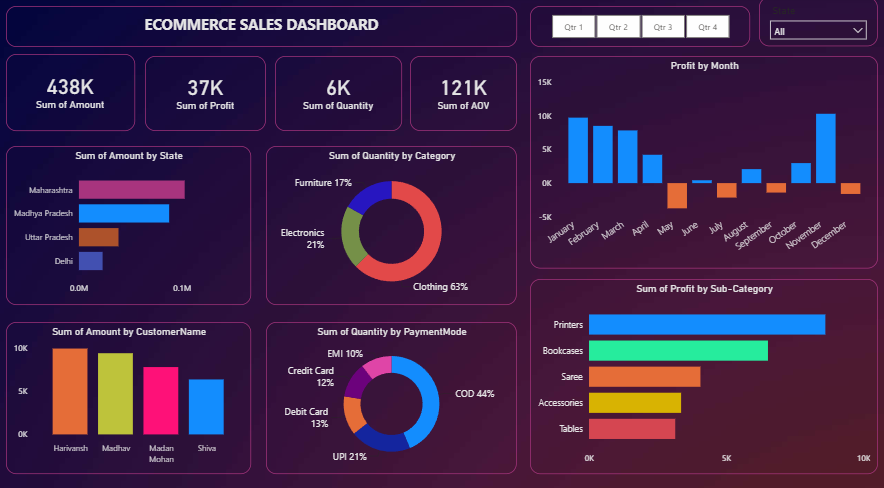
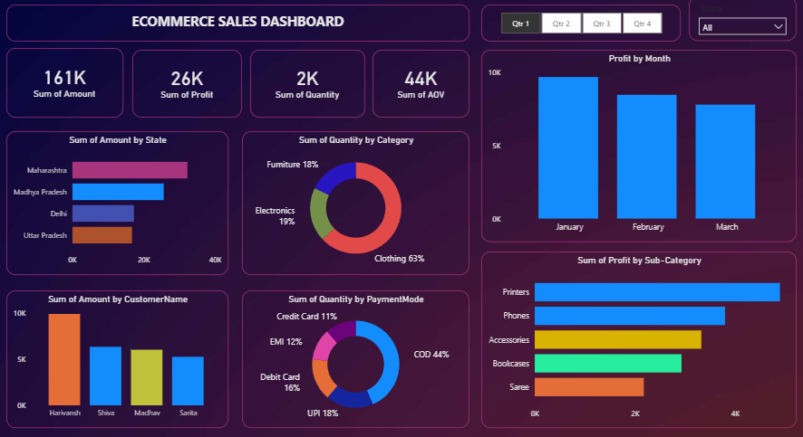
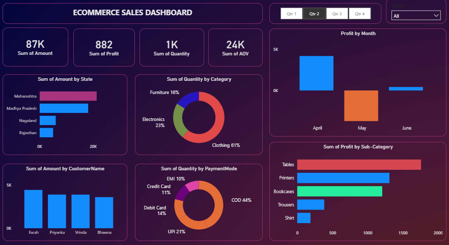
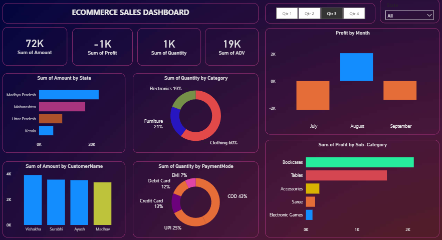
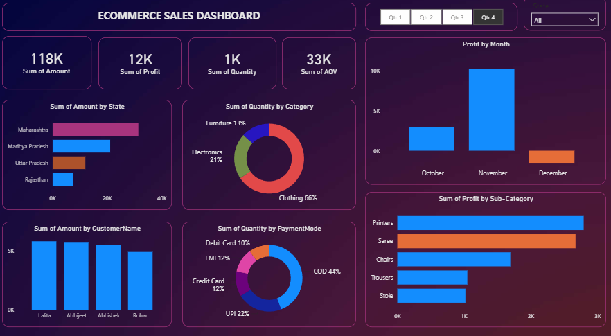
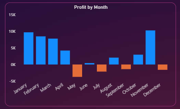
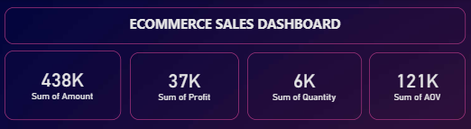

# 📊 E-Commerce Sales Dashboard | Power BI

An interactive **Power BI dashboard** built to analyze e-commerce sales data and transform raw business data into meaningful insights. This project demonstrates the complete Business Intelligence workflow, including data import, transformation, data modeling, DAX calculations, and dashboard development.

---

## 📌 Project Overview

The objective of this project is to analyze e-commerce sales performance by tracking key business metrics, identifying profitable products and regions, and understanding customer purchasing behavior. The dashboard enables users to interactively explore the data using Quarter and State filters.

---

## 🎯 Project Objectives

- Monitor overall business performance.
- Track sales, profit, quantity, and average order value.
- Analyze monthly profit trends.
- Identify top-performing states and customers.
- Understand product category performance.
- Analyze customer payment preferences.
- Build an interactive dashboard for business decision-making.

---

# 🛠️ Tools & Technologies

- Power BI Desktop
- Power Query
- DAX (Data Analysis Expressions)
- Data Modeling
- CSV Dataset
- Data Visualization

---

# 📂 Dataset

The dashboard was developed using two datasets.

### Orders Dataset

Contains:

- Order ID
- Order Date
- Customer Name
- State

### Details Dataset

Contains:

- Order ID
- Sales Amount
- Profit
- Quantity
- Category
- Sub-Category
- Payment Mode

---

# ⚙️ Project Workflow

## 1️⃣ Data Import

- Imported Orders.csv and Details.csv into Power BI.

---

## 2️⃣ Data Cleaning & Transformation

Performed data preprocessing using **Power Query**:

- Checked and corrected data types
- Removed inconsistencies
- Created custom columns
- Used Group By for aggregation
- Prepared clean data for analysis

---

## 3️⃣ Data Modeling

Created a **Many-to-One** relationship between the Orders and Details tables using **Order ID**, enabling accurate filtering and analysis across both datasets.

---

## 4️⃣ DAX Measures

Created custom measures including:

- Total Sales
- Total Profit
- Total Quantity
- Average Order Value (AOV)

---

## 5️⃣ Dashboard Development

Designed an interactive dashboard featuring:

- KPI Cards
- Monthly Profit Analysis
- Sales by State
- Quantity by Category
- Customer-wise Sales
- Profit by Sub-Category
- Payment Mode Distribution
- Quarter Filter
- State Filter

---

# 📈 Dashboard Features

✔ Interactive Quarter Filter (Qtr 1 – Qtr 4)

✔ State-wise Filtering

✔ Dynamic KPI Cards

✔ Monthly Profit Trend

✔ State-wise Sales Analysis

✔ Product Category Analysis

✔ Customer Sales Analysis

✔ Payment Mode Distribution

✔ Profit by Sub-Category

---

# 📊 Key Performance Indicators

| KPI | Value |
|------|-------|
| Total Sales | 438K |
| Total Profit | 37K |
| Total Quantity | 6K |
| Average Order Value | 121K |

---

# 📷 Dashboard Preview

## Complete Dashboard



---

## Quarter-wise Analysis

### Quarter 1



### Quarter 2



### Quarter 3



### Quarter 4



---

## KPI Overview



---

## Monthly Profit Trend



---

# 💡 Business Insights

- Maharashtra generated the highest overall sales.
- Clothing was the leading product category by quantity sold.
- Cash on Delivery (COD) was the most preferred payment method.
- Monthly profit varied significantly, indicating seasonal sales patterns.
- Printers were among the highest profit-generating sub-categories.
- Interactive filters enable users to analyze business performance by quarter and state.

---

# 📁 Repository Structure

```
Ecommerce-Sales-Dashboard-PowerBI
│
├── Dashboard
│   └── Ecommerce_Sales_Dashboard.pbix
│
├── Dataset
│   ├── Orders.csv
│   └── Details.csv
│
├── Images
│   ├── Dashboard_All.png
│   ├── Dashboard_Qtr1.png
│   ├── Dashboard_Qtr2.png
│   ├── Dashboard_Qtr3.png
│   ├── Dashboard_Qtr4.png
│   ├── KPI_Cards.png
│   └── Profit_by_Month.png
│
└── README.md
```

---

# 🚀 How to Use

1. Clone this repository.

```bash
git clone https://github.com/yourusername/Ecommerce-Sales-Dashboard-PowerBI.git
```

2. Open `Ecommerce_Sales_Dashboard.pbix` using **Power BI Desktop**.

3. Refresh the data if required.

4. Explore the dashboard using Quarter and State filters.

---

# 🎓 Skills Demonstrated

- Data Cleaning
- Data Transformation
- Power Query
- Data Modeling
- DAX Calculations
- Interactive Dashboard Design
- Business Intelligence
- Data Visualization
- KPI Reporting
- Analytical Thinking

---

# 🔮 Future Improvements

- Year-over-Year Sales Comparison
- Sales Forecasting
- Customer Segmentation
- Drill-through Reports
- SQL Database Integration
- Automated Data Refresh
